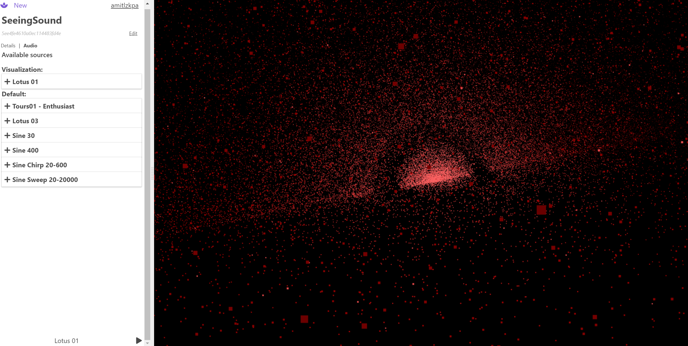
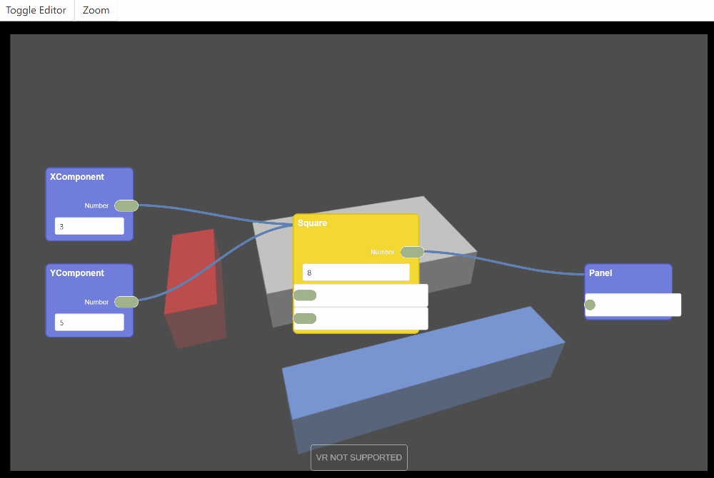

# Lotus Audio
Lotus Audio is a web app to create and share virtual environments from the browser. It uses the WebAudio API to process audio and passes the parsed audio track information to your script. The engine parses the value from your scripts and renders it as WebXR compatible environment.
Enable monetization of your creations using Web Monetization.



## Developer

### Node Editor


## Project setup
```
npm install
```

### Start server and hot-reloads for development
```
npm run dev
```

### Compiles and minifies for production
```
npm run build
```
